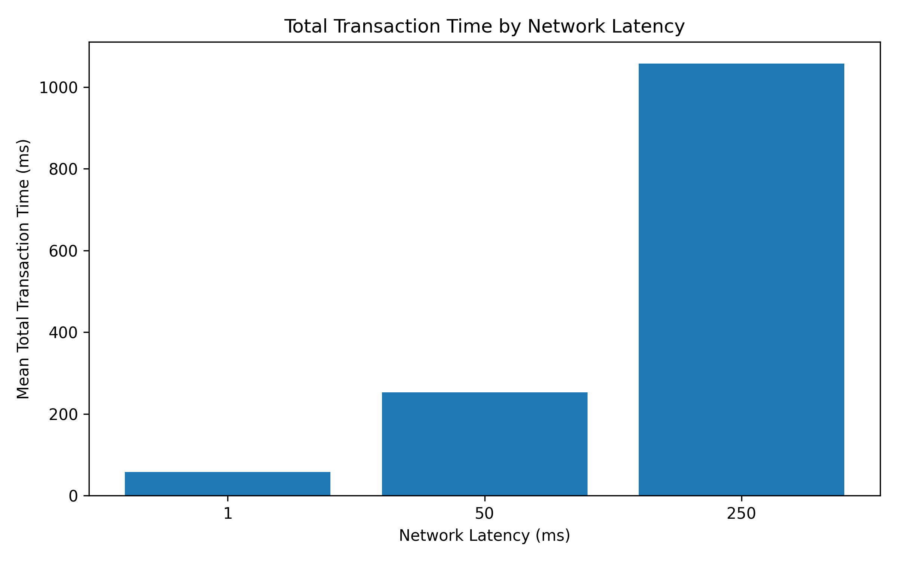
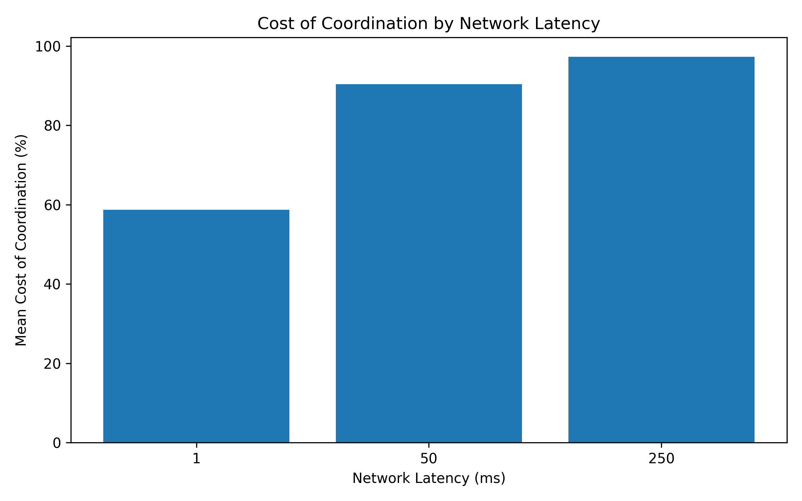
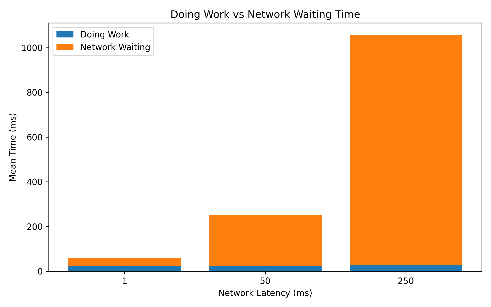
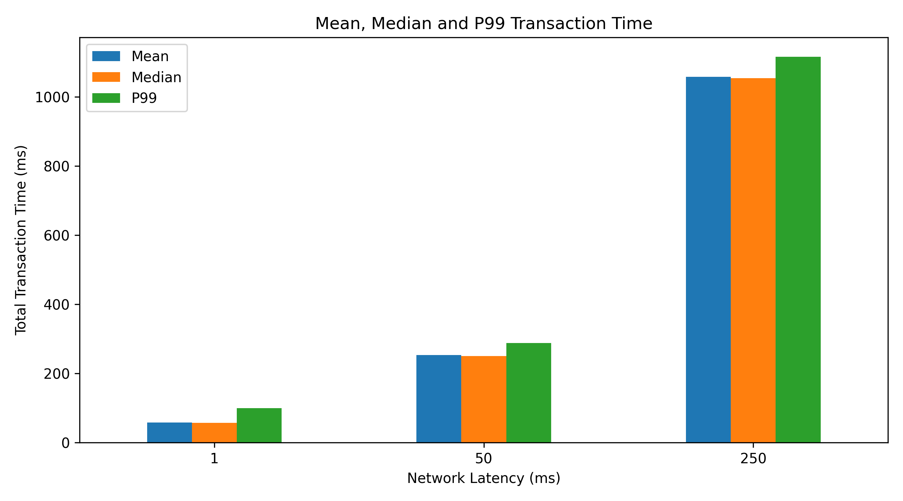

# Trans-Atlantic DB: Network Latency Impact Study

## 1. Thông tin đồ án

**Môn học:** Cơ sở dữ liệu phân tán
**Project ID:** #93 – Network Latency Impact Study: “Trans-Atlantic DB”
**Tên đề tài:** Nghiên cứu tác động của Network Latency đến Distributed Transaction sử dụng Two-Phase Commit
**Sinh viên thực hiện:** Lê Tiến Hưng
**Hình thức:** Đồ án cá nhân

---

## 2. Giới thiệu đề tài

Đồ án này mô phỏng một hệ cơ sở dữ liệu phân tán gồm một **Coordinator** và ba **Participant Node**. Hệ thống sử dụng giao thức **Two-Phase Commit – 2PC** để xử lý **Distributed Transaction**, đảm bảo các node cùng `Commit` hoặc cùng `Abort`, tránh tình trạng `partial commit`.

Mục tiêu chính của đồ án là nghiên cứu tác động của **Network Latency** đến thời gian xử lý Transaction trong hệ cơ sở dữ liệu phân tán. Khi các node nằm xa nhau hơn về mặt mạng, thời gian truyền thông giữa Coordinator và Participant Node tăng lên, làm tăng **Communication Cost** và **Cost of Coordination**.

Hệ thống mô phỏng ba mức Latency:

| Latency | Ý nghĩa                 |
| ------: | ----------------------- |
|     1ms | Local                   |
|    50ms | Regional                |
|   250ms | Global / Trans-Atlantic |

Kết quả Benchmark được phân tích dựa trên mô hình chi phí trong cơ sở dữ liệu phân tán:

```text
Cost = IO + CPU + Comm
```

Trong đó:

| Thành phần | Ý nghĩa                                    |
| ---------- | ------------------------------------------ |
| IO         | Chi phí đọc/ghi dữ liệu tại local database |
| CPU        | Chi phí xử lý logic Transaction            |
| Comm       | Chi phí truyền thông giữa các node         |

Trong đồ án này, `Comm` là thành phần bị ảnh hưởng trực tiếp bởi Network Latency.

---

## 3. Mục tiêu dự án

Dự án tập trung vào các mục tiêu sau:

1. Xây dựng hệ thống mô phỏng Distributed Database với 3 Participant Node.
2. Cài đặt giao thức Two-Phase Commit.
3. Mô phỏng Network Latency ở các mức 1ms, 50ms và 250ms.
4. Đo các metric như:
   - Total Transaction Time
   - Prepare Phase Time
   - Decision Phase Time
   - Doing Work Time
   - Network Waiting Time
   - Cost of Coordination

5. Chạy Benchmark nhiều lần để tính:
   - Mean
   - Median
   - P99
   - Min
   - Max
   - Standard Deviation
   - Abort Rate

6. Mô phỏng Failure Scenario bằng cách kill Node B.
7. Phân tích kết quả dựa trên lý thuyết:

```text
Cost = IO + CPU + Comm
```

---

## 4. System Architecture

Kiến trúc tổng quát của hệ thống:

```text
Client / Benchmark Script
          |
          v
    Coordinator Server
          |
   ---------------------
   |         |         |
 Node A    Node B    Node C
 SQLite    SQLite    SQLite
```

### Thành phần chính

| Thành phần                | Vai trò                               |
| ------------------------- | ------------------------------------- |
| Client / Benchmark Script | Gửi Transaction và chạy Benchmark     |
| Coordinator               | Điều phối giao thức Two-Phase Commit  |
| Node A                    | Participant Node lưu một phần dữ liệu |
| Node B                    | Participant Node lưu một phần dữ liệu |
| Node C                    | Participant Node lưu một phần dữ liệu |
| SQLite                    | Local storage cho từng node           |

Coordinator giao tiếp với các Participant Node thông qua **HTTP/REST API**.

---

## 5. Two-Phase Commit trong đồ án

Hệ thống sử dụng giao thức **Two-Phase Commit – 2PC** để đảm bảo tính **Atomicity** cho Distributed Transaction.

### Phase 1: PREPARE / VOTING

Coordinator gửi yêu cầu `/prepare` đến tất cả Participant Node.

Mỗi node kiểm tra:

- Node có liên quan đến Transaction không.
- Tài khoản gửi hoặc nhận có nằm trên node không.
- Tài khoản có tồn tại không.
- Số dư có đủ để thực hiện giao dịch không.
- Node có đang hoạt động bình thường không.

Sau đó node trả về:

```text
YES hoặc NO
```

### Phase 2: COMMIT / ABORT

Nếu tất cả node vote `YES`, Coordinator quyết định:

```text
GLOBAL COMMIT
```

Nếu có ít nhất một node vote `NO`, timeout hoặc bị lỗi, Coordinator quyết định:

```text
GLOBAL ABORT
```

Quy tắc quyết định:

```text
Nếu tất cả Participant Node vote YES → COMMIT
Nếu có ít nhất một node vote NO hoặc node lỗi → ABORT
```

Ý nghĩa của Two-Phase Commit là đảm bảo không xảy ra trường hợp một số node đã Commit nhưng node khác lại Abort.

---

## 6. Dataset

Dự án sử dụng dataset mô phỏng dạng **Financial Transactions**.

Dataset gồm:

- 1.000 tài khoản
- 10.000 Transaction

### Schema của Transaction

| Thuộc tính       | Ý nghĩa                  |
| ---------------- | ------------------------ |
| transaction_id   | Mã Transaction           |
| from_account     | Tài khoản gửi            |
| to_account       | Tài khoản nhận           |
| amount           | Số tiền giao dịch        |
| transaction_type | Loại giao dịch           |
| timestamp        | Thời gian phát sinh      |
| from_node        | Node chứa tài khoản gửi  |
| to_node          | Node chứa tài khoản nhận |
| status           | Trạng thái Transaction   |

---

## 7. Fragmentation Strategy

Dữ liệu tài khoản được chia theo **Horizontal Fragmentation** trên ba node:

```text
account_id % 3 = 0 → Node A
account_id % 3 = 1 → Node B
account_id % 3 = 2 → Node C
```

Ví dụ:

```text
ACC0001 → Node B
ACC0002 → Node C
ACC0003 → Node A
```

Cách chia này giúp mô phỏng tình huống một Distributed Transaction có thể liên quan đến nhiều node khác nhau.

Ví dụ Transaction:

```text
ACC0001 chuyển tiền cho ACC0002
```

Theo Fragmentation Strategy:

```text
ACC0001 → Node B → role DEBIT
ACC0002 → Node C → role CREDIT
Node A không liên quan → role NONE
```

---

## 8. Tech Stack

| Công nghệ          | Vai trò                                               |
| ------------------ | ----------------------------------------------------- |
| Python             | Ngôn ngữ lập trình chính                              |
| Flask              | Xây dựng REST API                                     |
| Requests           | Gửi HTTP request giữa Coordinator và Participant Node |
| SQLite             | Lưu trữ dữ liệu cục bộ tại từng node                  |
| Pandas             | Xử lý dữ liệu Benchmark                               |
| NumPy              | Tính toán thống kê                                    |
| Matplotlib         | Vẽ biểu đồ                                            |
| ThreadPoolExecutor | Gửi request song song đến các Participant Node        |

---

## 9. Cấu trúc thư mục

```text
trans-atlantic-db/
│
├── data/
│   ├── generate_dataset.py
│   ├── accounts.csv
│   └── financial_transactions.csv
│
├── nodes/
│   ├── init_nodes.py
│   ├── node_server.py
│   ├── node_a.db
│   ├── node_b.db
│   └── node_c.db
│
├── coordinator/
│   ├── coordinator.py
│   └── coordinator_log.csv
│
├── benchmark/
│   ├── run_benchmark.py
│   ├── results_raw.csv
│   └── results_summary.csv
│
├── analysis/
│   ├── analyze_results.py
│   └── charts/
│       ├── total_time_by_latency.png
│       ├── coordination_cost.png
│       ├── work_vs_network.png
│       └── mean_median_p99.png
│
├── docs/
│   ├── proposal.md
│   ├── design_document.md
│   ├── analysis_report.md
│   └── project_overview.md
│
├── README.md
├── requirements.txt
└── .gitignore
```

---

## 10. Cài đặt môi trường

### Bước 1: Clone repository

```bash
git clone <repository-url>
cd trans-atlantic-db
```

### Bước 2: Tạo virtual environment

Trên Windows PowerShell:

```powershell
python -m venv venv
.\venv\Scripts\activate
```

Nếu PowerShell chặn script, chạy:

```powershell
Set-ExecutionPolicy -Scope Process -ExecutionPolicy RemoteSigned
.\venv\Scripts\activate
```

Trên macOS/Linux:

```bash
python3 -m venv venv
source venv/bin/activate
```

### Bước 3: Cài đặt thư viện

```bash
pip install -r requirements.txt
```

Nội dung `requirements.txt`:

```txt
flask
requests
pandas
numpy
matplotlib
```

---

## 11. Tạo dataset

Chạy lệnh:

```bash
python data/generate_dataset.py
```

Sau khi chạy xong, hệ thống sẽ tạo:

```text
data/accounts.csv
data/financial_transactions.csv
```

Kiểm tra số dòng Transaction:

```powershell
python -c "import pandas as pd; df=pd.read_csv('data/financial_transactions.csv'); print('Rows:', len(df)); print(df.head())"
```

Kết quả mong muốn:

```text
Rows: 10000
```

---

## 12. Khởi tạo SQLite database cho các node

Chạy lệnh:

```bash
python nodes/init_nodes.py
```

Sau khi chạy xong, hệ thống sẽ tạo SQLite database riêng cho từng node:

```text
nodes/node_a.db
nodes/node_b.db
nodes/node_c.db
```

Kết quả mong muốn:

```text
Node A: 333 accounts
Node B: 334 accounts
Node C: 333 accounts
Khởi tạo database cho các Participant Node thành công.
```

Mỗi database có các bảng chính:

| Bảng                 | Ý nghĩa                                    |
| -------------------- | ------------------------------------------ |
| accounts             | Lưu tài khoản cục bộ của node              |
| pending_transactions | Lưu Transaction đang ở trạng thái PREPARED |
| transaction_log      | Ghi log các phase PREPARE, COMMIT, ABORT   |

---

## 13. Chạy các Participant Node

Mở 3 terminal riêng.

### Terminal 1: Node A

```powershell
python nodes/node_server.py --node A --port 5001
```

### Terminal 2: Node B

```powershell
python nodes/node_server.py --node B --port 5002
```

### Terminal 3: Node C

```powershell
python nodes/node_server.py --node C --port 5003
```

Nếu chạy thành công, terminal sẽ hiển thị dạng:

```text
Starting Node A
Database: ...\nodes\node_a.db
Port: 5001
Running on http://127.0.0.1:5001
```

---

## 14. Kiểm tra trạng thái các node

Trên Windows PowerShell, nên dùng `Invoke-RestMethod` hoặc `curl.exe`.

### Dùng Invoke-RestMethod

```powershell
Invoke-RestMethod -Uri "http://localhost:5001/health"
Invoke-RestMethod -Uri "http://localhost:5002/health"
Invoke-RestMethod -Uri "http://localhost:5003/health"
```

### Dùng curl.exe

```powershell
curl.exe http://localhost:5001/health
curl.exe http://localhost:5002/health
curl.exe http://localhost:5003/health
```

Kết quả mong muốn:

```text
Node A → UP
Node B → UP
Node C → UP
```

Lưu ý: Trong PowerShell, lệnh `curl` có thể bị hiểu thành `Invoke-WebRequest`. Vì vậy nên dùng `curl.exe` hoặc `Invoke-RestMethod`.

---

## 15. Kiểm tra tài khoản trong từng node

Ví dụ kiểm tra các tài khoản:

```powershell
Invoke-RestMethod -Uri "http://localhost:5001/accounts/ACC0003"
Invoke-RestMethod -Uri "http://localhost:5002/accounts/ACC0001"
Invoke-RestMethod -Uri "http://localhost:5003/accounts/ACC0002"
```

Kết quả mong muốn:

```text
ACC0003 → Node A
ACC0001 → Node B
ACC0002 → Node C
```

---

## 16. Test thủ công Two-Phase Commit trên Participant Node

Phần này dùng để kiểm tra riêng các Participant Node trước khi chạy Coordinator.

Transaction test:

```text
from_account = ACC0001
to_account   = ACC0002
amount       = 100
```

Theo Fragmentation Strategy:

```text
ACC0001 → Node B → role DEBIT
ACC0002 → Node C → role CREDIT
Node A không liên quan → role NONE
```

### Bước 1: Tạo body Transaction

```powershell
$body = @{
    transaction_id = "TX_MANUAL_001"
    from_account = "ACC0001"
    to_account = "ACC0002"
    amount = 100
    latency_ms = 1
} | ConvertTo-Json
```

### Bước 2: Gửi PREPARE đến 3 node

```powershell
Invoke-RestMethod -Uri "http://localhost:5001/prepare" -Method POST -ContentType "application/json" -Body $body
Invoke-RestMethod -Uri "http://localhost:5002/prepare" -Method POST -ContentType "application/json" -Body $body
Invoke-RestMethod -Uri "http://localhost:5003/prepare" -Method POST -ContentType "application/json" -Body $body
```

Kết quả mong muốn:

```text
Node A → vote YES, role NONE
Node B → vote YES, role DEBIT
Node C → vote YES, role CREDIT
```

### Bước 3: Gửi COMMIT đến 3 node

```powershell
$commitBody = @{
    transaction_id = "TX_MANUAL_001"
    latency_ms = 1
} | ConvertTo-Json

Invoke-RestMethod -Uri "http://localhost:5001/commit" -Method POST -ContentType "application/json" -Body $commitBody
Invoke-RestMethod -Uri "http://localhost:5002/commit" -Method POST -ContentType "application/json" -Body $commitBody
Invoke-RestMethod -Uri "http://localhost:5003/commit" -Method POST -ContentType "application/json" -Body $commitBody
```

Kết quả mong muốn:

```text
Node A → No local change
Node B → Committed successfully, role DEBIT
Node C → Committed successfully, role CREDIT
```

---

## 17. Xem log của Participant Node

Xem log Node A:

```powershell
Invoke-RestMethod -Uri "http://localhost:5001/logs?limit=5"
```

Xem log Node B:

```powershell
Invoke-RestMethod -Uri "http://localhost:5002/logs?limit=5"
```

Xem log Node C:

```powershell
Invoke-RestMethod -Uri "http://localhost:5003/logs?limit=5"
```

Log dùng để chứng minh hệ thống đã xử lý các phase:

```text
PREPARE
COMMIT
ABORT
```

---

## 18. Chạy Coordinator

Sau khi chạy đủ Node A, Node B và Node C, mở terminal mới và chạy:

```powershell
python coordinator/coordinator.py --port 8000
```

Nếu chạy thành công:

```text
Starting Coordinator
Port: 8000
Running on http://127.0.0.1:8000
```

Kiểm tra Coordinator:

```powershell
Invoke-RestMethod -Uri "http://localhost:8000/health"
```

Kiểm tra trạng thái các node thông qua Coordinator:

```powershell
Invoke-RestMethod -Uri "http://localhost:8000/nodes/health"
```

---

## 19. Gửi Transaction qua Coordinator

Khi dùng Coordinator, người dùng chỉ cần gửi một Transaction. Coordinator sẽ tự động điều phối toàn bộ Two-Phase Commit.

### Bước 1: Tạo Transaction

```powershell
$tx = @{
    transaction_id = "TX_COORD_001"
    from_account = "ACC0001"
    to_account = "ACC0002"
    amount = 100
    latency_ms = 1
} | ConvertTo-Json
```

### Bước 2: Gửi Transaction đến Coordinator

```powershell
$result = Invoke-RestMethod -Uri "http://localhost:8000/transaction" -Method POST -ContentType "application/json" -Body $tx
$result | ConvertTo-Json -Depth 10
```

Kết quả mong muốn:

```text
decision = COMMIT
status   = SUCCESS
```

Trong `prepare_results`:

```text
Node A → vote YES, role NONE
Node B → vote YES, role DEBIT
Node C → vote YES, role CREDIT
```

Trong `decision_results`:

```text
Node A → ack True, No local change
Node B → ack True, Committed successfully
Node C → ack True, Committed successfully
```

---

## 20. Metric được Coordinator đo

Mỗi Transaction qua Coordinator sẽ ghi các metric sau:

| Metric                    | Ý nghĩa                       |
| ------------------------- | ----------------------------- |
| transaction_id            | Mã Transaction                |
| latency_ms                | Mức Latency mô phỏng          |
| decision                  | COMMIT hoặc ABORT             |
| status                    | SUCCESS hoặc FAILED           |
| prepare_phase_ms          | Thời gian phase PREPARE       |
| decision_phase_ms         | Thời gian phase COMMIT/ABORT  |
| total_time_ms             | Tổng thời gian Transaction    |
| doing_work_ms             | Thời gian xử lý thật tại node |
| network_wait_ms           | Thời gian chờ mạng            |
| coordination_cost_percent | Cost of Coordination          |
| failed_nodes              | Node lỗi nếu có               |
| prepare_results           | Kết quả phase PREPARE         |
| decision_results          | Kết quả phase COMMIT/ABORT    |

Công thức chính:

```text
Network Waiting Time = Total Transaction Time - Doing Work Time
```

```text
Cost of Coordination (%) = Network Waiting Time / Total Transaction Time × 100
```

---

## 21. Test Latency 1ms, 50ms và 250ms

### Latency 1ms

```powershell
$tx1 = @{
    transaction_id = "TX_LATENCY_001"
    from_account = "ACC0001"
    to_account = "ACC0002"
    amount = 100
    latency_ms = 1
} | ConvertTo-Json

$result1 = Invoke-RestMethod -Uri "http://localhost:8000/transaction" -Method POST -ContentType "application/json" -Body $tx1
$result1.total_time_ms
$result1.coordination_cost_percent
```

### Latency 50ms

```powershell
$tx50 = @{
    transaction_id = "TX_LATENCY_050"
    from_account = "ACC0004"
    to_account = "ACC0005"
    amount = 100
    latency_ms = 50
} | ConvertTo-Json

$result50 = Invoke-RestMethod -Uri "http://localhost:8000/transaction" -Method POST -ContentType "application/json" -Body $tx50
$result50.total_time_ms
$result50.coordination_cost_percent
```

### Latency 250ms

```powershell
$tx250 = @{
    transaction_id = "TX_LATENCY_250"
    from_account = "ACC0007"
    to_account = "ACC0008"
    amount = 100
    latency_ms = 250
} | ConvertTo-Json

$result250 = Invoke-RestMethod -Uri "http://localhost:8000/transaction" -Method POST -ContentType "application/json" -Body $tx250
$result250.total_time_ms
$result250.coordination_cost_percent
```

Kết quả kỳ vọng:

```text
Latency 1ms   → total_time_ms thấp
Latency 50ms  → total_time_ms tăng rõ
Latency 250ms → total_time_ms tăng rất mạnh
```

---

## 22. Failure Scenario: Kill Node B

Mục tiêu của phần này là chứng minh hệ thống không bị **partial commit** khi một Participant Node bị lỗi.

### Bước 1: Cho Node B crash

```powershell
Invoke-RestMethod -Uri "http://localhost:5002/crash" -Method POST
```

Kiểm tra Node B:

```powershell
Invoke-RestMethod -Uri "http://localhost:5002/health"
```

Kết quả mong muốn:

```text
Node B → DOWN
```

### Bước 2: Gửi Transaction mới qua Coordinator

```powershell
$txFail = @{
    transaction_id = "TX_FAIL_NODE_B_001"
    from_account = "ACC0001"
    to_account = "ACC0002"
    amount = 100
    latency_ms = 1
} | ConvertTo-Json

$resultFail = Invoke-RestMethod -Uri "http://localhost:8000/transaction" -Method POST -ContentType "application/json" -Body $txFail
$resultFail | ConvertTo-Json -Depth 10
```

Kết quả mong muốn:

```text
decision = ABORT
status   = FAILED
failed_nodes có Node B
```

Ý nghĩa:

```text
Coordinator không nhận đủ vote YES.
Coordinator quyết định GLOBAL ABORT.
Các node còn lại thực hiện Rollback/Abort.
Không xảy ra partial commit.
```

### Bước 3: Khôi phục Node B

```powershell
Invoke-RestMethod -Uri "http://localhost:5002/recover" -Method POST
```

Kiểm tra lại toàn bộ node:

```powershell
Invoke-RestMethod -Uri "http://localhost:8000/nodes/health"
```

---

## 23. Xem log của Coordinator

Coordinator ghi log tại:

```text
coordinator/coordinator_log.csv
```

Xem log qua API:

```powershell
Invoke-RestMethod -Uri "http://localhost:8000/logs?limit=5"
```

Xem log dạng bảng:

```powershell
$logs = Invoke-RestMethod -Uri "http://localhost:8000/logs?limit=5"
$logs.logs | Format-Table transaction_id, latency_ms, decision, status, total_time_ms, coordination_cost_percent
```

---

## 24. Chạy Benchmark

Phần Benchmark dùng để chạy nhiều Transaction ở từng mức Latency và xuất kết quả phân tích.

Trước khi Benchmark, nên reset database để dữ liệu sạch:

```powershell
python nodes/init_nodes.py
```

Sau đó chạy lại Node A, Node B, Node C và Coordinator.

Chạy Benchmark:

```powershell
python benchmark/run_benchmark.py --latency 1 --runs 5 --transactions 100 --reset
python benchmark/run_benchmark.py --latency 50 --runs 5 --transactions 100
python benchmark/run_benchmark.py --latency 250 --runs 5 --transactions 100
```

Lưu ý: chỉ dùng `--reset` ở lệnh đầu tiên để xóa kết quả cũ. Nếu dùng `--reset` ở cả ba lệnh thì kết quả benchmark trước đó sẽ bị mất.

Kết quả sẽ được lưu tại:

```text
benchmark/results_raw.csv
benchmark/results_summary.csv
```

### Benchmark Methodology

Với mỗi mức Latency:

```text
Warm-up: 20 Transaction
Runs: 5
Transactions per run: 100
```

Tổng số Transaction đo chính thức:

```text
3 Latency × 5 Runs × 100 Transactions = 1500 Transactions
```

Các thống kê được tính:

| Thống kê           | Ý nghĩa                        |
| ------------------ | ------------------------------ |
| Mean               | Giá trị trung bình             |
| Median             | Giá trị trung vị               |
| P99                | Tail latency tại percentile 99 |
| Min                | Giá trị nhỏ nhất               |
| Max                | Giá trị lớn nhất               |
| Standard Deviation | Độ lệch chuẩn                  |
| Abort Rate         | Tỷ lệ Transaction bị Abort     |

---

## 25. Kết quả Benchmark

Kết quả benchmark tổng hợp:

| Latency | Transactions | Success | Abort Rate | Mean Total Time | Median Total Time | P99 Total Time | Mean Doing Work | Mean Network Waiting | Cost of Coordination |
| ------: | -----------: | ------: | ---------: | --------------: | ----------------: | -------------: | --------------: | -------------------: | -------------------: |
|     1ms |          500 |     500 |         0% |        57.97 ms |          56.98 ms |       99.21 ms |        23.25 ms |             34.72 ms |               58.70% |
|    50ms |          500 |     500 |         0% |       253.30 ms |         251.64 ms |      288.27 ms |        24.38 ms |            228.92 ms |               90.37% |
|   250ms |          500 |     500 |         0% |      1057.85 ms |        1053.72 ms |     1115.83 ms |        28.33 ms |           1029.52 ms |               97.33% |

Kết quả cho thấy hệ thống xử lý thành công toàn bộ 1500 Transaction trong điều kiện các node hoạt động bình thường. Abort Rate ở cả ba mức latency đều bằng 0%.

---

## 26. Phân tích kết quả và vẽ biểu đồ

Chạy lệnh:

```powershell
python analysis/analyze_results.py
```

Kết quả sẽ tạo các biểu đồ trong thư mục:

```text
analysis/charts/
```

Các biểu đồ đã tạo:

| Biểu đồ                   | Ý nghĩa                                          |
| ------------------------- | ------------------------------------------------ |
| total_time_by_latency.png | So sánh Mean Total Transaction Time theo Latency |
| coordination_cost.png     | So sánh Cost of Coordination                     |
| work_vs_network.png       | So sánh Doing Work và Network Waiting            |
| mean_median_p99.png       | So sánh Mean, Median và P99                      |

### Total Transaction Time by Network Latency



Biểu đồ cho thấy Mean Total Transaction Time tăng mạnh khi Network Latency tăng. Ở mức latency 1ms, thời gian trung bình là 57.97 ms. Khi latency tăng lên 50ms, thời gian tăng lên 253.30 ms. Ở mức latency 250ms, thời gian trung bình đạt 1057.85 ms.

Điều này chứng minh Network Latency có tác động trực tiếp đến thời gian xử lý Distributed Transaction sử dụng Two-Phase Commit.

### Cost of Coordination by Network Latency



Cost of Coordination tăng từ 58.70% ở mức latency 1ms lên 90.37% ở mức 50ms và 97.33% ở mức 250ms.

Điều này cho thấy khi các node nằm xa nhau về mặt mạng, phần lớn thời gian xử lý Transaction không còn nằm ở thao tác xử lý dữ liệu, mà nằm ở chi phí truyền thông và điều phối giữa Coordinator và Participant Node.

### Doing Work vs Network Waiting Time



Đây là biểu đồ quan trọng nhất trong phần phân tích.

Doing Work Time gần như ổn định:

```text
1ms   → 23.25 ms
50ms  → 24.38 ms
250ms → 28.33 ms
```

Trong khi đó, Network Waiting Time tăng rất mạnh:

```text
1ms   → 34.72 ms
50ms  → 228.92 ms
250ms → 1029.52 ms
```

Điều này chứng minh sự gia tăng tổng thời gian xử lý Transaction chủ yếu đến từ thời gian chờ mạng, không phải do thời gian xử lý thật tại node.

### Mean, Median and P99 Transaction Time



Mean, Median và P99 đều tăng khi Network Latency tăng. Điều này cho thấy ảnh hưởng của Network Latency là nhất quán trên toàn bộ tập Transaction, không chỉ xuất hiện ở một vài trường hợp bất thường.

P99 ở mức latency 250ms đạt 1115.83 ms, cho thấy các Transaction chậm nhất cũng bị ảnh hưởng rõ rệt bởi độ trễ mạng.

---

## 27. Liên hệ lý thuyết Özsu và Valduriez

Theo mô hình chi phí trong cơ sở dữ liệu phân tán:

```text
Cost = IO + CPU + Comm
```

Trong đồ án này:

| Thành phần | Ý nghĩa trong hệ thống                                  |
| ---------- | ------------------------------------------------------- |
| IO         | Chi phí đọc/ghi SQLite                                  |
| CPU        | Chi phí xử lý logic Transaction                         |
| Comm       | Communication Cost giữa Coordinator và Participant Node |

Trong thí nghiệm, các yếu tố sau được giữ gần như cố định:

```text
Dataset
Số lượng node
Database engine
Transaction logic
Cách đo metric
```

Biến được thay đổi có kiểm soát là:

```text
Network Latency
```

Do đó, khi Latency tăng, `Comm` tăng mạnh. Kết quả Benchmark chứng minh Communication Cost có thể trở thành yếu tố chi phối tổng thời gian xử lý Distributed Transaction.

Kết quả benchmark cho thấy:

```text
Latency 1ms   → Cost of Coordination = 58.70%
Latency 50ms  → Cost of Coordination = 90.37%
Latency 250ms → Cost of Coordination = 97.33%
```

Điều này phù hợp với lý thuyết `Cost = IO + CPU + Comm`, vì IO và CPU gần như không đổi, còn Comm tăng mạnh theo Network Latency.

---

## 28. Kết luận thực nghiệm

Kết quả thực nghiệm cho thấy Network Latency có ảnh hưởng rất lớn đến Distributed Transaction sử dụng Two-Phase Commit.

Khi latency tăng từ 1ms lên 50ms và 250ms:

```text
Mean Total Transaction Time:
57.97 ms → 253.30 ms → 1057.85 ms
```

Trong khi đó, Doing Work Time gần như ổn định:

```text
23.25 ms → 24.38 ms → 28.33 ms
```

Network Waiting Time tăng mạnh:

```text
34.72 ms → 228.92 ms → 1029.52 ms
```

Cost of Coordination tăng từ 58.70% lên 90.37% và 97.33%.

Điều này chứng minh rằng trong Distributed Transaction, đặc biệt với giao thức Two-Phase Commit, Communication Cost có thể trở thành thành phần chi phối tổng thời gian xử lý khi các node nằm xa nhau về mặt mạng.

---

## 29. Deliverables

Các sản phẩm cần nộp cho giảng viên:

| Deliverable           | File / Link                     |
| --------------------- | ------------------------------- |
| Project Proposal      | docs/proposal.md                |
| Design Document       | docs/design_document.md         |
| Code Repository       | GitHub/GitLab repository        |
| Analysis Report       | docs/analysis_report.md         |
| Proof Video           | Link video 3–5 phút             |
| Dataset               | data/financial_transactions.csv |
| Benchmark Raw Results | benchmark/results_raw.csv       |
| Benchmark Summary     | benchmark/results_summary.csv   |
| Charts                | analysis/charts/                |

---

## 30. Proof Video 3–5 phút

Kịch bản quay video đề xuất:

```text
0:00 – 0:30
Giới thiệu đề tài, mục tiêu và kiến trúc hệ thống.

0:30 – 1:15
Chạy Node A, Node B, Node C và Coordinator.

1:15 – 2:00
Gửi một Transaction bình thường và cho thấy GLOBAL COMMIT.

2:00 – 2:45
Mở kết quả Benchmark với Latency 1ms, 50ms, 250ms.

2:45 – 3:30
Mở các biểu đồ phân tích:
- Total Transaction Time
- Cost of Coordination
- Doing Work vs Network Waiting
- Mean, Median and P99

3:30 – 4:20
Kill Node B và gửi Transaction mới.
Cho thấy Coordinator quyết định GLOBAL ABORT.

4:20 – 5:00
Kết luận theo mô hình Cost = IO + CPU + Comm.
```

---

## 31. Current Progress

- [x] Tạo cấu trúc project
- [x] Viết dataset generator
- [x] Tạo dataset Financial Transactions
- [x] Khởi tạo SQLite database cho các node
- [x] Xây dựng Participant Node API
- [x] Test `/health`
- [x] Test `/prepare`
- [x] Test `/commit`
- [x] Test `/abort`
- [x] Test log của Participant Node
- [x] Xây dựng Coordinator
- [x] Implement Two-Phase Commit tự động qua Coordinator
- [x] Test Transaction qua Coordinator
- [x] Thêm Latency Simulation
- [x] Demo Failure Scenario với Node B
- [x] Viết Benchmark Script
- [x] Chạy Benchmark 1ms / 50ms / 250ms
- [x] Tính Mean, Median, P99
- [x] Tính Cost of Coordination
- [x] Vẽ biểu đồ
- [x] Viết Analysis Report
- [ ] Quay Proof Video
- [ ] Hoàn thiện repository để nộp

---

## 32. Trạng thái test hiện tại

Hệ thống Participant Node đã test thành công với Transaction thủ công:

```text
Transaction: TX_MANUAL_001
from_account: ACC0001
to_account: ACC0002
amount: 100
latency_ms: 1
```

Kết quả phase PREPARE:

```text
Node A → role NONE → vote YES
Node B → role DEBIT → vote YES
Node C → role CREDIT → vote YES
```

Kết quả phase COMMIT:

```text
Node A → No local change
Node B → Committed successfully
Node C → Committed successfully
```

Hệ thống Coordinator cũng đã test thành công với Transaction tự động qua endpoint:

```text
POST /transaction
```

Coordinator tự động thực hiện:

```text
PREPARE phase
GLOBAL COMMIT hoặc GLOBAL ABORT
COMMIT/ABORT phase
Ghi log
Trả kết quả về Client
```

Benchmark đã hoàn thành với 1500 Transaction chính thức ở ba mức Latency 1ms, 50ms và 250ms.

---

## 33. Kết luận

Dự án đã mô phỏng thành công một hệ cơ sở dữ liệu phân tán sử dụng Two-Phase Commit để xử lý Distributed Transaction. Hệ thống gồm một Coordinator và ba Participant Node, dữ liệu được phân mảnh ngang theo tài khoản và lưu trữ cục bộ bằng SQLite.

Kết quả Benchmark chứng minh rằng Network Latency có tác động rất lớn đến hiệu năng của Distributed Transaction. Khi Latency tăng từ 1ms lên 50ms và 250ms, tổng thời gian xử lý Transaction tăng mạnh, trong khi Doing Work Time gần như ổn định. Điều này cho thấy phần tăng chủ yếu đến từ Network Waiting Time và Communication Cost.

Kết quả thực nghiệm phù hợp với mô hình chi phí:

```text
Cost = IO + CPU + Comm
```

Trong môi trường phân tán có độ trễ cao, đặc biệt là mô hình Global hoặc Trans-Atlantic, Communication Cost có thể trở thành thành phần chi phối tổng chi phí xử lý Transaction. Vì vậy, khi thiết kế hệ thống Distributed Database, cần cân nhắc kỹ độ trễ mạng, vị trí triển khai node, chiến lược phân mảnh dữ liệu và giao thức commit được sử dụng.
